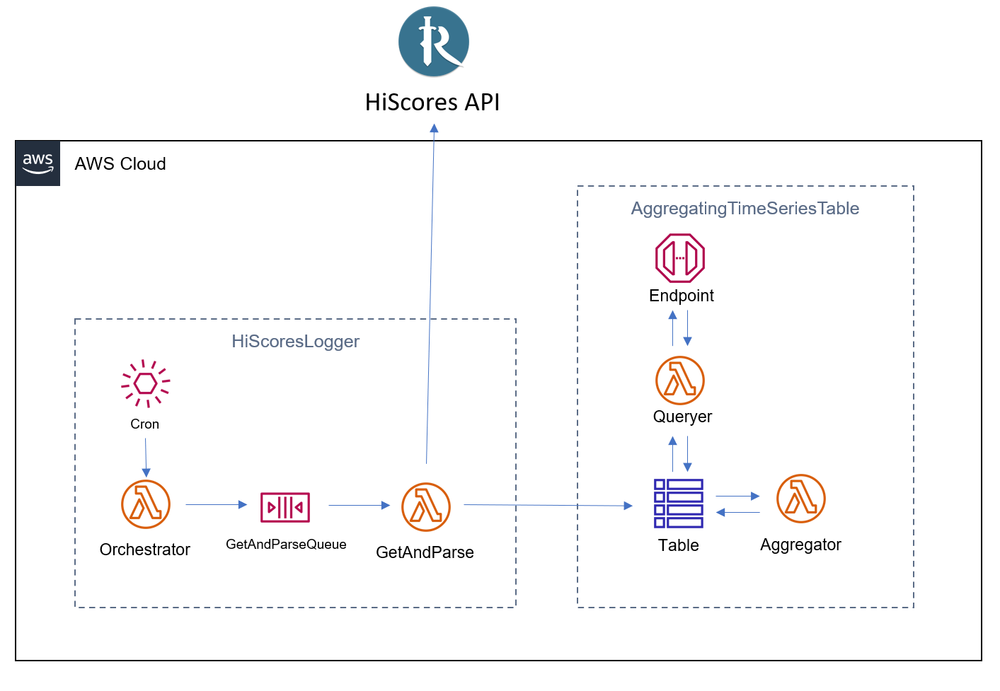

OSRS HiScores Tracking with AWS CDK
====================================


# Background

This project helps OSRS players to track and visualize their in-game progress using the HiScores API. It is built on Amazon Web Services and is easily bootstrapped using AWS CDK. As such, having an AWS account and the AWS CLI installed is a prerequisite.


# Service overview



The core service is built on two Constructs: `HiScoresLogger` and `AggregatingTimeSeriesTable`. 

The first uses a CloudWatch EventBridge to trigger an Orchestrator Lambda, which reads your configuration file and sends instruction messages to an SQS Queue. A Lambda Function listens to this queue, and when it receives a request for a username, it queries the HiScores API, parses the response, and saves it to a table.

The second is a DynamoDB Table with a Lambda Function subscribed to write events. When the table is written to, the Lambda aggregates the new record into a daily sum row. The table also comes with a query Lambda Function and API Gateway Endpoint for easy reading with configurable daily aggregation.

# CI/CD Architecture

Deployments are managed by a self-mutating AWS CodePipeline. Every push to `mainline` triggers a full pipeline run:

1. **Synth** — CDK synthesizes CloudFormation templates from source.
2. **Beta** — A full isolated copy of the stack is deployed. The EventBridge schedule is disabled so it never polls the live HiScores API.
3. **Integration Tests** — A smoke test triggers the ingest API and verifies data is returned by the query API. This stage must pass before production is updated.
4. **Prod** — The production `HiscoresTrackerStack` is updated in-place, preserving all existing DynamoDB data.

The pipeline is self-mutating: changes to the pipeline definition itself are applied automatically on the next run.

# Getting Started

You can create an instance of this service for yourself using AWS CDK. The initial setup deploys the pipeline; all subsequent changes deploy automatically on push.

## Prerequisites

### 1. Install Python
You can find the latest release at https://www.python.org/downloads/. Python 3.9 or later is required.

### 2. Create a free-tier AWS account
If you don't already have one, go to https://aws.amazon.com/free and sign up.

### 3. Configure permissions
You will need to create a new IAM policy to deploy this application. After creating your account, navigate to IAM within the AWS management console. Create a new policy with the following permissions:
* IAMFullAccess
* AWSCodeDeployFullAccess
* AdministratorAccess
* AWSCloudFormationFullAccess

Now, create a new IAM group and attach this policy to it. Following this, create a user in the group for yourself.

### 4. Install the AWS CLI
Follow [these instructions](https://docs.aws.amazon.com/cli/latest/userguide/getting-started-install.html). To verify that it works: `which aws`.

### 5. Configure the AWS CLI
With the IAM user you created above, follow [these instructions](https://docs.aws.amazon.com/cli/latest/userguide/cli-configure-quickstart.html#cli-configure-quickstart-creds) to configure your AWS CLI.

### 6. Install the CDK CLI

```bash
npm install -g aws-cdk@2.0.0
```

### 7. Create a GitHub CodeStar connection

The pipeline pulls source from GitHub. Create a connection in the AWS console under **CodePipeline → Settings → Connections**, or via the CLI:

```bash
aws codestar-connections create-connection \
    --provider-type GitHub \
    --connection-name cdk-hiscores-tracker
```

Complete the OAuth handshake in the console to move the connection from `PENDING` to `AVAILABLE`. Copy the resulting connection ARN.

### 8. Store the connection ARN in SSM Parameter Store

```bash
aws ssm put-parameter \
    --name /hiscores-tracker/github-connection-arn \
    --value "arn:aws:codestar-connections:REGION:ACCOUNT:connection/YOUR-ID" \
    --type String
```

The pipeline reads this value at synth time so the ARN is never committed to source.

## Clone and configure the repo

```bash
git clone https://github.com/awerchniak/cdk-hiscores-tracker.git
cd cdk-hiscores-tracker
```

Edit `lambda/orchestrator/players.txt` to list the usernames you want to track (one per line, minimum 1).

## Deploy the pipeline

```bash
python -m venv .venv
source .venv/bin/activate
pip install -r requirements.txt
cdk bootstrap aws://ACCOUNT-NUMBER/REGION
cdk deploy HiscoresPipelineStack
```

This creates the CodePipeline. The pipeline immediately runs its first execution, deploying Beta and then Prod automatically. You can monitor progress in the AWS CodePipeline console.

After the initial deploy, **all future changes deploy automatically** when you push to `mainline`. You do not need to run `cdk deploy` again.

## Finding your API endpoints

After the pipeline completes its first run, the Prod stack outputs are visible in CloudFormation:

```
HiscoresTrackerStack.HiScoresATSTQueryHiScoresDataEndpoint = https://<id>.execute-api.us-east-1.amazonaws.com/prod/
HiscoresTrackerStack.TriggerHiScoresLogEventEndpoint       = https://<id>.execute-api.us-east-1.amazonaws.com/prod/
```

**QueryHiScoresDataEndpoint** — `GET` with query parameters `player`, `startTime`, `endTime`.

**TriggerHiScoresLogEventEndpoint** — `POST` with no parameters. Triggers an immediate ingest for all configured players.

## Cleanup

To tear down all resources:

```bash
cdk destroy HiscoresPipelineStack
```

Note: this will also remove the Beta and Prod stacks managed by the pipeline. The Prod DynamoDB table has deletion protection; you will need to disable it manually before the destroy completes.

# Contributing

We welcome contributions. Fork the repo and open a pull request against `mainline`. We will respond within one week.

Merging to `mainline` triggers the pipeline automatically. The integration test suite runs against the Beta stage before any change reaches production.

## Running unit tests locally
```bash
pip install -r requirements-dev.txt
bash run_tests.sh
```

## Running integration tests locally
To run the integration test against a manually deployed stack, note your trigger and query URLs from the CloudFormation outputs and run:

```bash
python run_integration_test.py \
    -i YOUR_TRIGGER_LOG_EVENT_URL \
    -o YOUR_QUERY_DATABASE_URL
```
